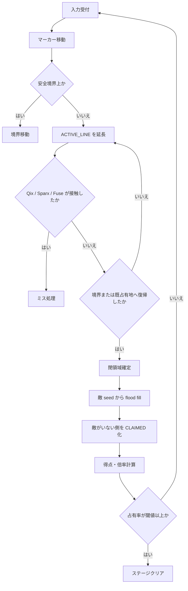

# タイトーのアーケードゲーム『QIX』と派生作品群の調査報告

## エグゼクティブサマリ

『QIX』の核は、**「境界上では安全、内部に踏み込むと脆弱」**という空間ルールと、**Fast / Slow Draw によるリスクと報酬の二重化**にある。公式現行説明では、1981年に **TAITO AMERICA** が開発し、その後日本に導入された作品とされる。サービスマニュアルでは占有率の工場設定が **75%**、Time Line の工場設定が **37秒**、さらに画面ごとに QIX の攻撃性を独立調整できることが確認できる。つまり『QIX』は、単純な面積取りではなく、**占有率閾値・時間圧・内部侵入時の接触死**を組み合わせた、非常に制度設計寄りのゲームである。 citeturn36search2turn45view0turn45view3turn43view2turn49view0

派生の流れは、公式系だけでも **QIX → Super QIX → Volfied → Qix Adventure → QIX Neo → Battle Qix → QIX++ → Qix Galaxy** という系譜を持ち、MobyGames 上の公式シリーズ集約では **8作品** が確認できる。一方で、同サイトの「QIX variants」集約では **84作品** が記録されており、メカニクス自体が **Xonix系、Gals Panic系、AirXonix系、Cubixx系** などへ広く拡散したことが分かる。つまり『QIX』は単発の古典ではなく、**“territory capture by vulnerable drawing” という抽象メカニクスの母体**として機能した。 citeturn28view0turn31view0turn30search3turn52search1turn50view5turn51search11

自作オマージュを商用・公開前提で作るなら、**メカニクスを採ること**と **表現を似せること**は切り分ける必要がある。日本の著作権法上、保護対象は「思想又は感情を創作的に表現したもの」であり、文化庁の解説も**著作権は表現、特許はアイデア**を保護すると整理している。米国著作権局も、**ゲームのアイデア、タイトル、遊び方の方法**は著作権そのものでは保護されないと明示している。他方で、**名称、出所表示、視聴覚表現、トレードドレス、混同惹起**は別問題であり、公式移植・再販が現在も継続している以上、**同名・酷似HUD・同系敵名・同色設計**は避けるべきだ。Tetris v. Xio 判決も、「ルールだけ」 defense では足りず、**代替表現が多数あるのに近似した見た目を採ること**が危険であることを示している。 citeturn37search0turn37search13turn37search3turn37search2turn38search0turn36search0turn36search6turn40view0turn39search2

実装面では、原作基板が **256×256・8bpp の Screen RAM** を持つビットマップ機で、ビデオプロセッサが line drawing を担当していた事実を踏まえると、現代でも **整数グリッド前提の実装** が最も相性がいい。基本は、未占有セル・占有セル・描画中ラインをビットフラグで持ち、ライン閉鎖時に **flood fill** か **連結成分ラベリング** で「敵がいる側」を生存領域として残し、残りを占領領域に変換する設計が堅い。ブラウザでは **requestAnimationFrame**、必要なら **OffscreenCanvas + Worker**、モバイルでは **profiling first** と軽量 UI/物理・オーディオ設定が妥当である。 citeturn53view4turn43view2turn48search1turn48search6turn48search15turn46search14turn46search1turn46search5turn46search13

## 公式版 QIX の設計分析

まず確認できる事実だけを固定する。現行公式の **Arcade Archives QIX** と Nintendo Store 商品説明は、本作を **1981年に TAITO AMERICA が開発し、米国で成功した後に日本へ導入されたライン描画パズル**と説明している。設計者名については、今回直接確認できた一次資料の中心がサービスマニュアルと再販商品説明であり、**企画初期の詳細な開発史は薄い**。ただし、アーカイブ系データベースでは **Randy Pfeiffer / Sandy Pfeiffer** への帰属が繰り返し記録されているため、これは**強いアーカイブ上の合意**として扱うのが妥当で、タイトー現行公式が前面に出しているのは「TAITO AMERICA 起源」である。 citeturn36search2turn27search6turn49view0

ゲームメカニクスの核は、**矩形フィールドの縁を安全地帯にし、そこから内部へ “Stix” を伸ばして閉領域を作る**設計にある。MobyGames の公式説明とアーケードマニュアルのユーザー説明は、プレイヤーがマーカーを操作して領域を囲い、**Slow Draw のほうが高得点**であること、完成前の線やマーカーに Qix が触れると失敗になること、さらに **Sparks が境界を巡回し、Fuse も描画線を伝って脅威化する**ことを示している。Arcade Archives 公式ページも、QIX と Sparx を避けつつ **75%以上** を占有するのが目標だと説明している。ここで重要なのは、危険判定が「プレイヤー本体」ではなく **“未完成の線” を含む**ことだ。これが、移動ゲームではなく**作図ゲームとしての緊張**を成立させている。 citeturn49view0turn36search2turn27search6turn11view0turn11view1

スコアリングは、一次資料で確認できる範囲ではかなり明瞭だ。アーケード説明では **Fast Draw は青、Slow Draw は赤で、Slow Draw は 2 倍価値**とされる。サービスマニュアルでは工場設定 75% を超える占有率や operator 調整が示され、2002年の携帯移植紹介でも **75%以上でクリア、より多く占有すると高得点、99% でスペシャルボーナス**とある。さらに家庭用マニュアル／解説系資料では **Fast = 1% あたり100点、Slow = 1% あたり200点、基準超過 1% ごとに 1,000 点**という式が明示される。ここで厳密に言うと、**アーケード原本 OCR から 100/200/1000 の点式を鮮明には読めない**。したがって、安全な結論は「**原作アーケードで Slow 優遇と占有率ボーナスの概念は一次資料で確認でき、詳細点式は家庭用初期移植群で明文化されている**」である。学術的に完全を期すなら、紙面の鮮明な flyer / operator card の再確認が必要だ。 citeturn11view2turn11view3turn15search3turn15search4turn15search8turn41search11

難易度曲線は、実はかなり“運営設計可能”である。サービスマニュアルによれば、必要占有率は **最大 99% まで調整可能**、工場設定は **75%**、Time Line は **最大 99秒まで調整可能**、工場設定は **37秒** で、さらに Screen 1 は 1 QIX、Screen 2 も 1 QIX、Screen 3 と 4 は **2 QIX** になり、画面ごとに **0–3 段階で QIX の攻撃性**を変えられる。つまり原作の難しさは、「固定された伝説的難ゲー」ではなく、**占有率閾値、時間圧、敵数、敵 aggression を別々に調律できる運営ゲーム**でもあった。オマージュ制作でここを見落とすと、単に“線を引いて囲うゲーム”になる。原作の本質は、**閾値設計の調整弁が多いこと**にある。 citeturn45view0turn45view1turn45view2turn45view3

UI/UX は今日見ても合理的だ。プレイヤー入力は **4-way joystick** に **Fast Draw / Slow Draw の 2 ボタン**、1–2人交互プレイである。Slow / Fast を別入力にしたことで、原作は「高速・低配当」と「低速・高配当」を**UI そのものに埋め込んだ**。ここは現代移植でしばしば“1ボタン長押し”に潰されやすいが、ゲームの読み合いを最も作っている箇所なので、オマージュでも**二系統入力の価値差**は残したほうがいい。視覚面では、線の色がそのまま価値を表し、プレイヤーは HUD を読まずに**走査中のリスクと期待値**を視認できる。これは古いが強いUXだ。 citeturn13view4turn13view5turn49view0turn11view2

ハードウェア制約は、オマージュ設計に直接効く。QIX 基板は、サービスマニュアル上 **Data Processor / Video Processor / Sound Processor** の 3 論理ブロックからなり、Video Board 側には **20MHz** の基本クロック系、**256×256・8bpp** の Screen RAM、**6845系 CRT Controller** があり、Data/Video は同期しつつ **Dual Port RAM** を共有する。Sound は Data Board 上の **Motorola 6802** が担当する。この構成は、スプライト主体ではなく**ビットマップを書き換える前提**の設計だ。だからこそ『QIX』は、キャラクター位置よりも**領域状態そのものをゲーム状態にする**。現代のオマージュでも、浮動小数点ポリゴンより **整数グリッド + ラスタ塗り**のほうが、原作の手触りにも性能にも合う。 citeturn43view2turn43view3turn53view4turn43view1

## 派生作品の系譜と比較表

MobyGames のシリーズ集約は、2026年時点で **QIX 公式シリーズを 8作品**、QIX 系メカニクスの非公式派生・変種を **84作品** と数えている。以下の表は、その中でも**影響が大きい、または制作研究上参照価値が高い主要作品**を、確認できた範囲で年代順に並べたものだ。なお、**後年タイトルの一部は accessible な一次資料が薄く、開発/発売企業が fully verified でない行がある**。そこは明示している。 citeturn28view0turn31view0

| 年 | タイトル | 区分 | プラットフォーム | 確認できた開発/発売 | ゲーム性の差分 | 出典 |
|---|---|---|---|---|---|---|
| 1981 | QIX | 原点 | Arcade | TAITO AMERICA 開発、Taito 発売 | 75%占有、Fast/Slow Draw、QIX・Sparx・Fuse/Time Line による三層圧力。 | citeturn36search2turn49view0turn45view0 |
| 1981頃 | Qix II: Tournament | 公式更新版 | Arcade | Taito | 公開ソース上はトーナメント版／強化版として扱われる。詳細差分の一次資料は今回十分に確認できず、少なくとも色・調整違い中心とされる。 | citeturn29search1turn19search2 |
| 1982–1991、2003、2022 | QIX 各種移植群 | 公式移植 | Atari 5200、Atari 8-bit、FM-7、DOS、C64/128、Amiga、Apple II、Game Boy、Apple IIgs、Lynx、NES、J2ME、PS4、Switch | Atari / Taito / Nintendo / Hamster など複数社。プラットフォームごとに開発委託が異なる。 | ルール忠実度は高いが、練習モード、難度設定、携帯向け簡略化、現代版のオンラインランキングや設定変更などを追加。 | citeturn49view0turn44search8turn41search11turn36search0 |
| 1984 | Xonix | クローン系祖 | DOS | 企業詳細は今回確認不足 | QIX 系を PC 向けに単純化・普及させた代表格。後の AirXonix 系の母体。 | citeturn30search3 |
| 1987 | Super QIX | 正統続編 | Arcade | Taito | 16ラウンド、**power-up**、速度強化、shield、敵停止、文字収集ボーナス、98%以上で残機。原典ループに“ご褒美システム”を入れた。 | citeturn50view2turn42search1 |
| 1989 | Volfied | 正統発展型 | Arcade、後年移植 | Taito | SF化。**80%** 奪還、ship+barrier の概念、敵弾や巨大敵、難度選択。QIX を“演出的に分かりやすくした”進化形。 | citeturn50view1turn50view0 |
| 1990 | Gals Panic | 派生ジャンル化 | Arcade | Kaneko 系。日本では Taito 名義流通、米国では Kaneko USA 流通という説明が確認できる。 | 占有で背景画像を露出。**80%** silhouette uncover、ボーナス記号あり。QIX メカニクスを“視覚報酬ゲーム”へ変質させた。 | citeturn52search1turn52search3 |
| 1992 | JezzBall | Windows casual 変種 | Windows 16-bit | Microsoft Entertainment Pack 収録 | 境界から自由に囲うのではなく、**直線壁を伸ばして跳ねるボールを閉じ込める**方向へ再設計。QIX 葉脈の中でも別枝。 | citeturn31view0turn52search10 |
| 1995 | Twin Qix | 公式拡張 | Arcade | Taito | **two-player mode** と新敵・多めの power-up を追加。QIX を対戦・協力寄りへ押し出した試み。 | citeturn52search0 |
| 1999 | Qix Adventure | 携帯機続編 | Game Boy Color | 確認できた企業: Coconuts Japan Entertainment Co., Ltd. | treasure mode、beast と chest、items、battle mode、原作収録。QIX に軽い ADV/RPG 文脈を載せた。 | citeturn50view3 |
| 1999 | Panic Street | Gals Panic 非成人派生 | Arcade | 企業詳細は今回確認不足 | Gals Panic 系だが **nudity なし**、アニメ絵、**diagonal move**。報酬系だけを脱成人化した系統。 | citeturn33search1 |
| 2000 | AirXonix | 3D リメイク系 | Windows、後年 iPhone/iPad | 企業詳細は今回確認不足 | Xonix の **full 3D** 化、5モード、80以上の level、power-up。メカニクスを立体演出へ持ち込んだ。 | citeturn50view5 |
| 2001 | QIX Neo | 公式リメイク | PlayStation | Taito 開発、D3Publisher 発売 | **Volfied のリメイク**。AV 強化、force-field、boss、power-up、**70%** でクリアまたは boss kill、旧版同梱。 | citeturn54view0 |
| 2002 | Battle Qix | 公式派生 | PlayStation | MobyGames 公式シリーズ掲載。accessible source では企業情報の完全確認不足。 | 検索スニペット上は reward-image を伴う remake / battle 方向。商用調査前に別途裏取り推奨。 | citeturn28view0turn51search9 |
| 2002 | QIX 携帯版 | 公式モバイル移植 | J-Phone Java | Taito | 75% クリア、99% special bonus、ステージ進行で QIX 数・速度が増加。携帯向け縮約版。 | citeturn41search11 |
| 2009 | QIX++ | 現代的続編 | Xbox 360、PSP | Taito（公式商品ページあり） | スタイリッシュな現代リメイク。二次資料では **new Qix types、power-up、multiplayer、PSP の追加モード**、原作収録が確認される。 | citeturn34search4turn34search2 |
| 2010 / 2016 | Cubixx / Cubixx HD | 3D 解釈 | PSP / PS3 / Switch / Steam など | Cubixx HD は Laughing Jackal 開発、Ghostlight 発売と確認可能 | **立方体表面を切り取る** 3D 高速コンボ型。QIX の空間認知を 3D へ一般化。 | citeturn31view0turn51search11turn51search18 |
| 2014 | Qix Galaxy | 公式モバイルスピンオフ | Android、iPhone、iPad | App Store では公式系アプリとして確認。企業詳細の完全確認は今回不足。 | 「classic QIX based」の SF mobile adaptation。 | citeturn28view0turn51search2 |
| 2022 | Arcade Archives QIX | 公式再販 | PS4、Switch | Hamster / 原作 Taito | 原作忠実移植に、難度変更、CRT 風設定、オンラインランキング。ブランドが**現在も生きている**重要証拠。 | citeturn36search0turn36search13 |
| 2024 | Arcade Archives VOLFIED | 公式再販 | PS4、Switch | Hamster / 原作 Taito | Volfied の忠実再販。QIX 系サブブランドも現役。 | citeturn50view1 |
| 2024 | TAITO Milestones 3 | 公式コンピレーション | Switch | Taito | QIX を収録。再販権利運用が継続している。 | citeturn36search6turn36search4 |

ここから読める系譜は単純だ。**Super QIX は “報酬を足した QIX”**、**Volfied は “演出と敵パターンを強化した QIX”**、**Qix Adventure は “モードと収集を足した携帯向け QIX”**、**QIX Neo は “Volfied の 2001年再解釈”** である。他方 **Gals Panic** は、ルールをほぼ温存しつつ報酬だけを差し替えたことで、QIX の抽象性を**ジャンル化**した。オマージュ制作の観点では、これは重要な教訓だ。**核は “面を取ること” ではなく “危険を横断して面を閉じること”** にあるので、報酬層や世界観層の差し替え余地は非常に大きい。 citeturn50view2turn50view1turn50view3turn54view0turn52search1

## 代表的な派生ごとのゲーム性比較

比較対象として価値が高いのは、**QIX、Super QIX、Volfied、Qix Adventure、QIX Neo、QIX++、Gals Panic、AirXonix / Cubixx** だ。理由は、これらがそれぞれ **「原型」「報酬追加」「演出強化」「携帯機文脈」「リメイク」「近代化」「報酬層差し替え」「空間次元変更」** を代表しているからだ。 citeturn50view2turn50view1turn50view3turn54view0turn34search2turn52search1turn50view5turn51search11

| 作品 | クリア条件 / 主ルール | 追加要素 | 難易度調整の主手段 | オマージュ制作で抽出すべき点 | 出典 |
|---|---|---|---|---|---|
| QIX | 75% 占有。Fast/Slow Draw。QIX・Sparx・Fuse。 | なし。抽象度が高い。 | 閾値、Time Line、QIX 数、QIX aggression。 | ルールが最も純粋。まずこれを分解して理解すべき。 | citeturn36search2turn45view0turn49view0 |
| Super QIX | 基本は QIX。 | power-up、shield、freeze、letters、98% extra life。 | アイテム取得で危険を局所的に無効化。 | ご褒美を加えると“解法の多様性”が増える。 | citeturn50view2 |
| Volfied | 80% 奪還。ship は barrier off 時に脆弱。 | SF 世界観、敵弾、巨大敵。 | 敵パターンと視覚演出、難度レベル。 | “抽象幾何”を嫌う現代層には演出文脈が効く。 | citeturn50view1turn50view0 |
| Qix Adventure | 75% 占有を維持。 | beast / chest / treasure、items、battle mode。 | 収集・装備・モード分化。 | コアメカを壊さずに meta-loop を足せる実例。 | citeturn50view3 |
| QIX Neo | Volfied 系。70% または boss kill。 | force-field、boss、power-up、旧版収録。 | boss 戦 / projectile / 70% 閾値。 | “ボス条件”は面積取りに別勾配を作れる。 | citeturn54view0 |
| QIX++ | 現代リメイク。 | new Qix types、power-up、4人戦、PSP 追加 mode。 | 敵タイプ差、mode 差、対戦。 | モード分岐で寿命を延ばす方向。 | citeturn34search4turn34search2 |
| Gals Panic | 80% 背景露出。 | 視覚報酬、bonus symbol。 | 報酬期待と敵圧。 | 報酬の差し替えだけで別市場になる。 | citeturn52search1 |
| AirXonix / Cubixx | QIX/Xonix を 3D 化。 | 3D 空間、複数モード、combo。 | 認知負荷と視覚負荷を増幅。 | 3D 化は可能だが、可読性が崩れると本質が死ぬ。 | citeturn50view5turn51search11turn51search18 |

この比較から、オマージュ制作で最も実用的な結論は三つある。第一に、**難易度を上げる最短手段は敵を増やすことではなく、「描画中だけ脆弱」というルールを強調すること**だ。第二に、**追加要素は power-up か meta progression のどちらか一方に寄せたほうが設計が濁らない**。Super QIX は前者、Qix Adventure は後者のいい実例だ。第三に、**3D 化・豪華演出化は、理解コストが上がるぶん線の可読性を毀損しやすい**。原作が強い理由は“見た瞬間に危険線が読める”ことなので、3D 演出を入れるなら playable readability を最優先にすべきだ。 citeturn50view2turn50view3turn50view5turn51search11

## 実装技術と設計指針

原作基板の仕様から逆算すると、現代実装でも **整数グリッド** が最も自然だ。原作は **256×256 / 8bpp の Screen RAM** を持ち、Video Processor が **line drawing** を担当していた。これは、ポリゴンメッシュ中心ではなく、**ラスタ面を直接更新するゲーム**だったことを意味する。したがって、オマージュ実装でもロジック平面は **256×256 か 320×240 の logical grid** に固定し、表示だけを拡大する設計が最も安定する。浮動小数点ベクタだけで組むより、**セル単位の接触判定・塗り潰し・再現性**が一気に楽になる。 citeturn53view4turn43view2

実装の基本データ構造は、少なくとも次の四層で足りる。  
**playfield grid** は `FREE / CLAIMED / BORDER / ACTIVE_LINE` のビットフラグを持つ 2D 配列。  
**enemy state** は Qix 系自由移動敵、Sparx 系境界追従敵、Fuse/Time Line を別 struct に分ける。  
**perimeter graph** は境界追従敵用のグラフとして持つ。単純な全辺探索でも動くが、占有が増えるほど無駄が増えるので、**境界 loop を半辺グラフとして持つ**と Sparx が軽くなる。  
**dirty region queue** は描画差分更新用。これはブラウザでもモバイルでも効く。  
この方法なら、ロジック更新と描画更新を疎結合にしやすい。 citeturn49view0turn53view4

閉領域処理は、**「敵がいる側を残し、いない側を取る」**だけだ。単純な flood fill でも十分動くが、フィールドが大きくなったり simultaneous hazard が増えるなら、**連結成分ラベリング + union-find** の二段構成がより伸びる。CCL 文献では union-find ベースの二走査法が定番で、高解像度画像・複雑画像でも有利とされている。QIX 型ゲームでは、ライン閉鎖のたびに全画面 BFS を回す naive 実装でもプロトタイプは成立するが、完成版では **capture 時だけ chunk or local ROI を処理する**設計にした方が安定する。 citeturn48search1turn48search6turn48search15turn47search0

```text
擬似コード:
onLineClosed(activeLine):
    rasterize(activeLine, ACTIVE_LINE)

    live = empty_mark_grid()
    seed_list = enemy_positions_inside_free_space()

    for seed in seed_list:
        flood_fill(seed, passable = FREE, mark = live)

    captured_cells = FREE cells not marked in live
    convert(captured_cells, CLAIMED)
    convert(activeLine, CLAIMED)

    if split_bonus_rule:
        enemy_components = connected_components_over(live, enemy_positions)
        if enemy_components >= 2:
            apply_split_multiplier()

    score += area_score(captured_cells, draw_mode, over_threshold_bonus)
    if claimed_ratio() >= clear_threshold:
        stage_clear()
```



敵 AI は種類ごとに完全に分けるべきだ。**Qix 型自由移動敵**はランダム成分を含むベクトル移動でよく、**“プレイヤーを直接追尾しないが、描画線と偶発的に交差する”**ことが大事だ。ここをホーミング化すると別ゲームになる。**Sparx 型**は perimeter graph 上の path follower にし、**Fuse** は「描画停止時間」または「線長」に基づいて active line を進行させればいい。原作マニュアルが QIX の aggression と Time Line を別軸で operator 調整にしているのは、まさにこの**異種脅威の圧力が別物**だからだ。オマージュでもそこは分けるべきだ。 citeturn45view0turn45view3turn49view0

プラットフォーム差は明確だ。**ブラウザ**は `requestAnimationFrame()` を主ループにし、重い塗り処理や描画を worker へ逃がしたいなら **OffscreenCanvas** が有効だ。DOM をまたぐやり方はこの手のゲームに向かない。**モバイル**は最初から profile 前提で、UI と physics と audio の既定設定を盛りすぎないことが重要になる。Unity docs も Godot docs も、最初にやるべきは勘ではなく**計測**だと明言している。**PC** は無理に高フレームレート化するより、リプレイ、エディタ、modding、accessibility を足すほうが価値が高い。QIX 型は GPU を焼くゲームではない。CPU 上の状態遷移が主役だ。 citeturn46search14turn46search1turn46search5turn46search13

## オマージュ作品向け UI UX 案

一番大事なのは、**原作の“二系統入力の価値差”は残し、見た目は変える**ことだ。原作は 4-way joystick と Fast / Slow の 2 ボタンで、Slow を高配当にしていた。これを現代入力に落とすなら、パッドでは **左スティック / D-pad + RT=Fast, LT=Slow**、キーボードでは **矢印 + Z/X** が妥当だ。1ボタン長押しで速度切替にまとめると“便利”にはなるが、原作の**意思決定の明快さ**が落ちる。プレイヤーは「今どの価値の線を引いているか」を瞬時に知る必要がある。 citeturn13view4turn13view5turn11view2

視覚表現は、**ロジックの可視化**に振り切るべきだ。原作の優れている点は、線色がそのまま価値を表していたことだが、オマージュで同じ配色・同じ菱形マーカー・同じ HUD レイアウトを使うと**法的にも美術的にも弱い**。推奨は、  
**安全状態**を desaturated line、  
**高配当 carve** を太さ・粒子・残像で識別、  
**敵危険域** を淡い heat / interference 表現、  
**境界追従敵** を perimeter 上の pulse として描く、  
という分け方だ。要するに、「昔の色替え」を「現代の情報設計」に翻訳する。見た目は変えるが、情報量は減らさない。 citeturn11view2turn36search2turn40view0

サウンド設計は最小主義が合う。原作基板では、サウンド制御がスクリーン上のイベントと結び付けられ、ステレオ増幅系の制御も説明されている。ここから素直に引き出せる現代案は、**内部侵入中だけ基音を上げる tension hum、Sparx の位置を左右へ pan させる warning、閉領域成立時に位相反転を伴う click / release** だ。BGM を厚くするより、**位置・緊張・確定の三音価**に分けたほうが、このジャンルは強い。 citeturn53view4

難易度設計は、原作の operator 発想をそのまま借りればいい。推奨テンプレートは次だ。最初の数面は **1 free-roaming enemy + 長い fuse delay + 低め閾値**。中盤で **perimeter enemy** を足す。次に **dual-Qix または split bonus** を入れる。終盤で **特殊敵 or terrain gimmick** を入れる。つまり、敵数だけでなく、**脅威の種類**を段階的に増やす。原作が占有率・Time Line・QIX aggression を別ツマミにしていたのは、難しさの正体が一つではないからだ。オマージュでも、その多軸性を保つべきだ。 citeturn45view0turn45view1turn45view3

レベルデザインの雛形としては、以下が扱いやすい。

| レベル帯 | 構成 | 狙い |
|---|---|---|
| 導入 | 1自由敵、境界敵なし、閾値 68–72% | 「内部に入る怖さ」を覚えさせる |
| 基礎応用 | 1自由敵 + 1境界敵、閾値 72–75% | 線の引き始め位置を学ばせる |
| 中盤 | 2自由敵または split bonus、閾値 75–78% | 大胆カットか小刻み占有かを選ばせる |
| 後半 | 特殊敵、弾、障害セル、閾値固定 | 盤面の読みを増やす |
| ボーナス | 敵弱化、時短、特殊報酬 | カタルシスと稼ぎの場 |
| 終盤 | 複合脅威、ただし可読性優先 | “理不尽”ではなく“濃い”状態を作る |

このテンプレートの重要点は、**毎面で違う gimmick を足すことではなく、「何が増えたか」を一目で理解できること**だ。QIX 型は新要素を盛りすぎると一気に読めなくなる。読みやすさを壊した時点で、このジャンルは終わる。

## 法的考察

日本法ベースの出発点は明快だ。著作権法は、著作物を**「思想又は感情を創作的に表現したもの」**と定義している。文化庁の解説も、**著作権は表現を保護し、アイデアは特許の領域**と整理している。米国著作権局も、ゲームについて **アイデア、タイトル、遊び方の方法は copyright では保護されない**と明記している。したがって、**「危険を横切って線を引き、敵がいない側を確保する」**という抽象メカニクス自体は、そのままでは著作権の独占対象になりにくい。ここはかなり硬い。 citeturn37search0turn37search13turn37search3

だが、ここで止まると危ない。保護されるのはメカニクスではなくても、**具体的な表現**は保護される。具体的には、**タイトル名、敵名、マーカー形状、配色体系、効果音、BGM、HUD 配置、メニュー文言、パッケージ、プロモ画像、コード**は、それぞれ別の権利や法理に引っかかる可能性がある。QIX は 2022年に Arcade Archives で、2024年に TAITO Milestones 3 でも再販されており、ブランドは休眠していない。つまり、**今も権利者が市場で使っている表示**である。商標法は商標保護を目的とし、不正競争防止法は**周知な商品等表示と同一・類似の表示による混同惹起**を禁じる。だから商用タイトルを **「QIX」** や **「クイックス」** に寄せるのは、著作権以前に危ない。 citeturn36search0turn36search6turn37search2turn38search0

国際的注意点としては、**Tetris Holding v. Xio** が分かりやすい。公式判決文では、Xio 側が「ルールや機能など非保護要素だけを細心にコピーした」と主張したのに対し、裁判所は **copyright infringement と trade dress** を認めた。判決文は、色や形や盤面寸法などについて、**他の設計選択肢が多数あり得る**こと、そしてそれらが商品の機能そのものではないことを重視している。要するに、**“遊び方の抽象は借りてもよい” は “近い見た目で売ってよい” を意味しない**。これは QIX 型でも同じだ。菱形カーソル、同種の敵ネーミング、同様の境界色、同様の attract 風文言、同様の販促画面を重ねると、法的にも市場的にも自滅しやすい。 citeturn40view0turn39search2

実務上のリスクを率直に整理すると、こうなる。

| 企画内容 | リスク評価 | 理由 |
|---|---|---|
| コアメカニクスのみ継承。タイトル・美術・音・敵設定・UI を全面刷新 | 低〜中 | ルール抽象の継承に留まり、混同可能性が低い |
| 似た見た目だがタイトルは変更 | 中〜高 | “look and feel” と市場混同の争点が残る |
| タイトルも似せ、菱形カーソル・Qix/Sparx類似名称・色設計も近い | 高 | 商標・不競法・表現近似のリスクが重なる |
| 原作アセット、音、コード、販促画像、説明文を流用 | 極高 | 直接侵害に近い |

回避策はシンプルだ。**名前を変える、敵の概念を変える、世界観を変える、視覚言語を変える、勝利文脈を変える**。例えば、  
原作の “Qix / Sparx / Marker” を使わず、  
敵を「流体」「干渉波」「監視線」など**別の ontology** に変え、  
フィールドを矩形一枚ではなく **可変トポロジ** にし、  
勝利条件を「一定面積」だけでなく「資源回収」「電力再配線」「感染遮断」などへ変える。  
ここまで変えれば、尊敬の表明は残しつつ、表現模倣からかなり離れられる。なお、特許・商標・意匠の現行状態は別途確認が必要で、商用化前には **J-PlatPat** 等で名称・関連権利を検索し、必要なら専門家レビューを入れるべきだ。今回の調査では、**QIX メカニクスに関する現行特許の有無までは確定していない**。そこは未確認だ。 citeturn38search13turn37search13turn37search2turn38search0

## 制作ロードマップと優先ソース

まず、制作ロードマップはこう切るのが現実的だ。

| フェーズ | 期間目安 | 主な成果物 | 体制目安 | 人月目安 |
|---|---:|---|---|---:|
| 仕様固定前プロトタイプ | 2〜4週 | 1ステージ、1敵、占有判定、失敗処理、スコア仮実装 | 1人 | 0.5〜1.0 |
| コア完成版 | 4〜8週 | 境界敵、fuse、複数難度、HUD、入力最適化 | 1〜2人 | 1.5〜3.0 |
| 縦スライス | 6〜10週 | 10〜20面、音、演出、設定、セーブ、実績 | 2〜3人 | 3.0〜5.0 |
| 完成版 | 3〜6か月 | キャンペーン、モード分岐、QA、UX改善、ストア対応 | 2〜4人 | 8.0〜14.0 |

予算感は、**非商用**なら自前開発を前提に現金支出は **5万〜30万円** 程度でもいける。主に SFX、フォント、UI アイコン、テスト端末、ストア登録費程度だ。**商用インディー**として売るなら、外注を最低限に抑えても **600万〜1,800万円** は見ておいた方がいい。内訳は、開発 8〜14 人月、アート、SFX/BGM、QA、ローカライズ、ストア・告知、法務レビューだ。正直に言えば、このジャンルは技術的には軽いが、**“手触りの微調整” に時間が溶ける**。予算を食うのはグラフィックよりチューニング時間だ。

技術スタックは、狙う販路で決めればいい。**Unity** はモバイル・コンソール展開に強く、プロファイリングや最適化周辺の情報も厚い。**Godot** は 2D 小規模開発との相性が良く、最適化も profile-first で進めやすい。**ブラウザ** は TypeScript + Canvas/WebGL、主ループは `requestAnimationFrame`、重い描画は `OffscreenCanvas` を使うと整理しやすい。QIX 型では 2D 物理エンジンはほぼ不要で、**自前の occupancy grid と敵更新**のほうが管理しやすい。 citeturn46search14turn46search1turn46search5turn46search13

最後に、今回の調査で優先度が高かったソースを並べる。学術引用や商用の権利確認に使うなら、まずこの順で当たればいい。

| 種別 | 用途 | 優先 URL |
|---|---|---|
| QIX サービスマニュアル | 原典の入力、難度設定、基板構成、画面RAM | `https://archive.org/details/ArcadeGameManualQix` |
| 現行公式商品説明 | 公式の位置付け、現役ブランド確認 | `https://www.arcadearchives.com/en/title/aca-198/` |
| 現行公式販売説明 | 同上、別流通経路での裏取り | `https://www.nintendo.com/us/store/products/arcade-archives-qix-switch/` |
| TAITO 公式情報 | QIX の現行収録確認 | `https://www.taito.co.jp/taitomilestones` |
| VOLFIED 公式再販説明 | 正統発展型の比較基準 | `https://www.arcadearchives.com/en/title/aca-301/` |
| 公式シリーズ集約 | 年代順の正史把握 | `https://www.mobygames.com/group/366/qix-series/` |
| 派生群集約 | クローン／変種の広がり把握 | `https://www.mobygames.com/group/3678/qix-variants/` |
| 著作権法 | 日本法の基本線 | `https://laws.e-gov.go.jp/law/345AC0000000048` |
| 商標法 | 名称利用の基本線 | `https://laws.e-gov.go.jp/law/334AC0000000127` |
| 不正競争防止法 | 混同惹起の基本線 | `https://laws.e-gov.go.jp/law/405AC0000000047` |
| 文化庁解説 | 表現とアイデアの整理 | `https://www.bunka.go.jp/seisaku/chosakuken/seidokaisetsu/pdf/94215301_01.pdf` |
| 米国著作権局 | 国際的なルール/メカニクス整理 | `https://www.copyright.gov/register/tx-games.html` |
| Tetris 判決資料 | look-and-feel リスクの国際参考 | `https://www.govinfo.gov/app/details/USCOURTS-njd-3_09-cv-06115/USCOURTS-njd-3_09-cv-06115-0` |

今回の調査の限界も明記しておく。**アーケード原版の詳細点数式**は OCR 可能な原典では完全に鮮明でなく、家庭用初期移植のマニュアルで補った。**Battle Qix / Qix Galaxy の企業情報**は、accessible な一次資料が薄く、存在・年・プラットフォームは確認できても company line の完全確定は要再調査である。逆に言えば、学術精度や商用法務を一段上げたいなら、次の追加調査ポイントはその二点に絞っていい。 citeturn11view2turn15search3turn28view0turn51search2turn51search9